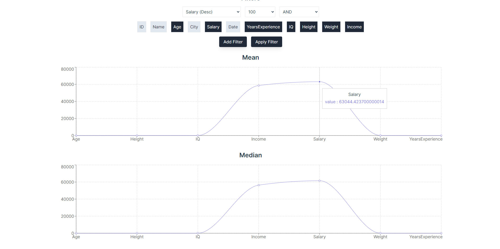
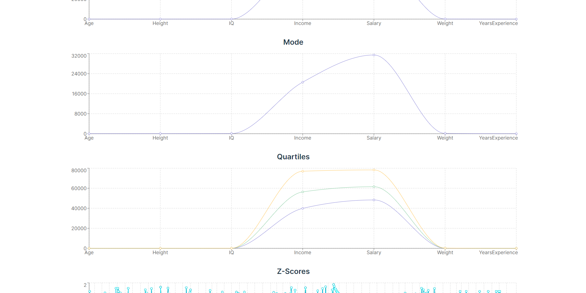
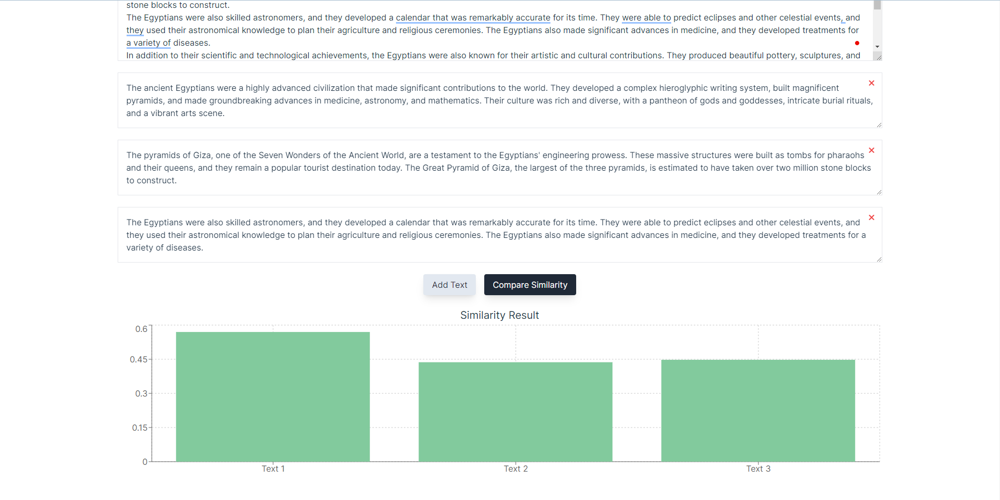
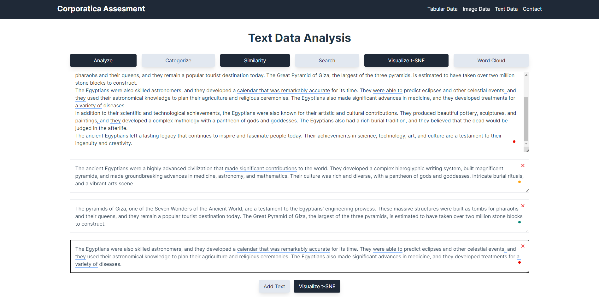

# Corporatica Assessment Frontend

This project was bootstrapped with [Vite](https://vitejs.dev/).

## Available Scripts

In the project directory, you can run:

### `npm install`
### `npm run dev`
### `npm run build`

## Main Libraries Used

- [React](https://reactjs.org/)
- [Vite](https://vitejs.dev/)
- [react-router-dom](https://reactrouter.com/web/guides/quick-start)
- [Tailwind CSS](https://tailwindcss.com/)
- [postcss](https://postcss.org/)
- [fontawesome](https://fontawesome.com/)
- [axios](https://axios-http.com/)
- [framer-motion](https://www.framer.com/motion/)
- [recharts](https://recharts.org/en-US/)
- [react-toastify](https://fkhadra.github.io/react-toastify/introduction)

## Folder Structure
    
    ```
    .
    ├── public
    ├── screenshots
    ├── src
    │   ├── assets
    │   ├── components
    │   ├── pages
    │   ├── services
    │   App.jsx
    │   App.css
    │   main.jsx
    ├── index.css
    ├── RootLayout.jsx
    ├── router.jsx
    ├── routes.jsx
    ├── tailwind.config.js
    ├── postcss.config.js
    ├── ErrorsHandler.jsx
    ├── .eslintrc.js
    ├── .gitignore
    ├── README.md
    ├── vite.config.js
    ├── package.json
    ├── package-lock.json


    ```
## Features

- **Tabular Data**:
    - Upload any tabular data file (CSV, XLSX) and display it in a table.
    - Search, Sort, Filter, Paginate and more complex queries.
    - Customizable which columns to display.
    - Chart visualization of the data for the following:
        - Mean, Median, Mode, Quartiles, Z-Score
    
- **Image Gallery**:
    - Upload any image file and display it in a gallery.
    - The following features are available:
        - Upload multiple images at once.
        - View images in a gallery.
        - Preview image 
        - Image histogram visualization.
        - Apply Masking to the image from predefined masks.
        - Change Image RGB values.
        - Resize Image.
        - Crop Image.
        - Convert Image to PNG, JPEG, BMP, TIFF, GIF.
        - Download Original Image or any edited image.

- **Text Data**:
    Contains a text manipulation tool that allows the following features:
    - Analyze text data:
        - Word Count
        - Character Count
        - Sentence Count
        - Paragraph Count
        - Named Entity Recognition (NER) Bar Chart
        - Sentiment Analysis Bie Chart
        - Text Summarization
        - Text Extracted Keywords
    - Categorized text data:
        - Upload text data and categorize it into predefined categories.
        - View the categorized data in a Bar Chart.
    - Text Similarity:
        - Compare a list of text data against a reference text and get the similarity score.
        - View the similarity score in a Bar Chart.
    - Text Search:
        - Search for a specific query in a text data and get the results as list of text sentences and score for each sentence.
        - View the results in a Bar Chart.
        - View the results in a Table containing the sentence and score.
    - Text Visualize T-SNE:
        - Visualize text data list against a reference text as a 2D T-SNE plot.
        - View the plot with the text data points and the reference text point.
    
    - Text Word Cloud:
        - Generate a word cloud from a text data.
        - View the word cloud with the most frequent words in the text data.


## Screenshots

    ### Tabular Data
    
    
    
    
    
    
    

    ### Image Gallery
    
    
    

    ### Text Data
    
    
    
    
    
    
    
    
    
    
    
    
    
    

## Author

- [Ahmed Saied](https://ahmedsaied.info/)
- [Linkedin](https://www.linkedin.com/in/ahmedsaied94/)
- [email](ahmed.saeed311294@gmail.com)
- [phone](https://wa.link/u55712)
- [github](https://github.com/AhmedSaied94)
